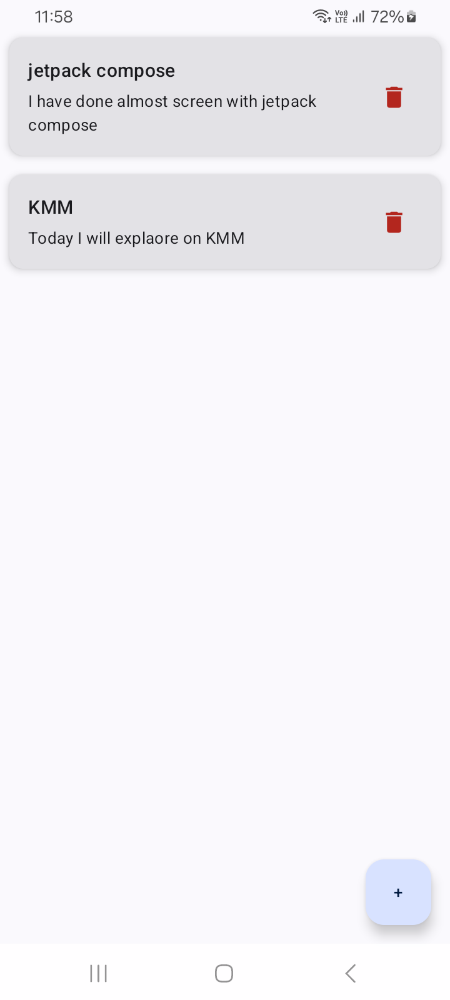
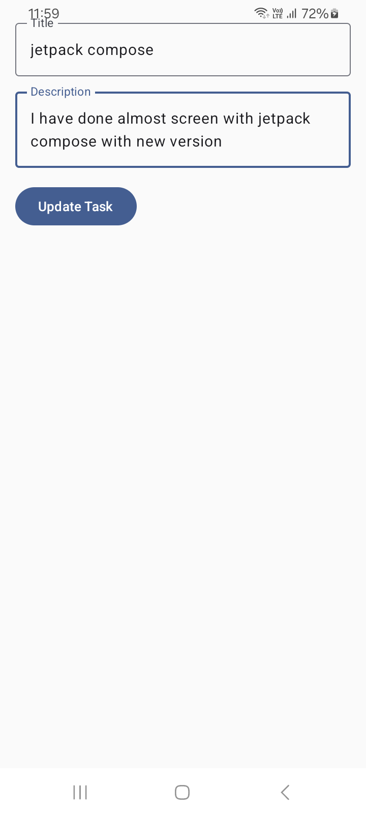
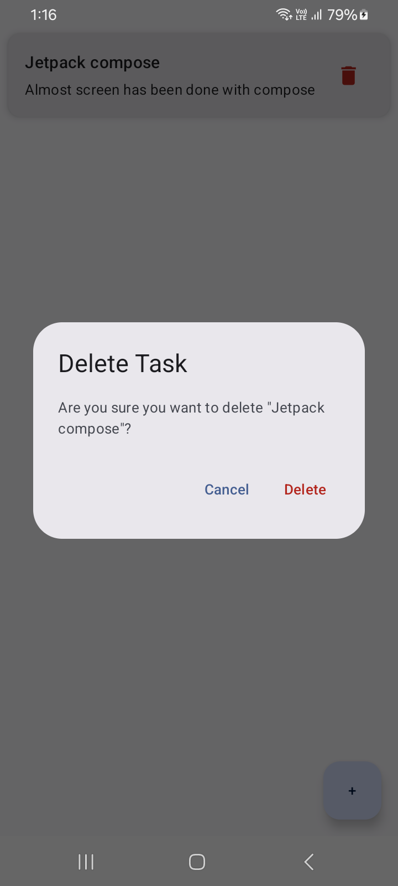

# 📅 DailyTaskManager

A modern Android To-Do + Reminder app built with **Jetpack Compose**, **MVVM**, **Clean Architecture**, and **Room**.  
Designed to help users manage daily tasks efficiently with a clean UI and offline-first support.
---
## ✨ Features
- ✅ Add new tasks with title, description, and time
- 🗑️ Delete tasks with confirmation dialog
- 📋 View tasks in a scrollable list
- 🚫 Show "No Task Now" when list is empty
- 💾 Offline support with Room DB
- 🧪 Unit tested core logic using JUnit & MockK
---

## 📸 Screenshots

| Home Screen          | Add Task            | Delete Confirmation    | Empty State           |
|----------------------|---------------------|------------------------|-----------------------|
|  |  |  |  |

---

## 🛠️ Tech Stack

### 🧱 Architecture
- **MVVM** (Model-View-ViewModel)
- **Clean Architecture** (Domain, Data, Presentation Layers)
- **Dependency Injection** with Hilt

### ⚙️ Core Libraries
- [Jetpack Compose](https://developer.android.com/jetpack/compose)
- [Room](https://developer.android.com/jetpack/androidx/releases/room)
- [Hilt](https://developer.android.com/training/dependency-injection/hilt-android)
- [Kotlin Coroutines](https://kotlinlang.org/docs/coroutines-overview.html)
- [Flow](https://developer.android.com/kotlin/flow)

### 🧪 Testing
- [JUnit](https://junit.org/junit5/)
- [MockK](https://mockk.io/)
- [kotlinx-coroutines-test](https://kotlin.github.io/kotlinx.coroutines/kotlinx-coroutines-test)

---

## 🧪 Unit Test Examples

- ✅ `TaskViewModelTest.kt` for ViewModel logic
- ✅ `GetTasksUseCaseTest.kt` for domain logic
- 🔁 Tested with mocked use cases using MockK
- 🧵 Coroutine testing with `runTest`